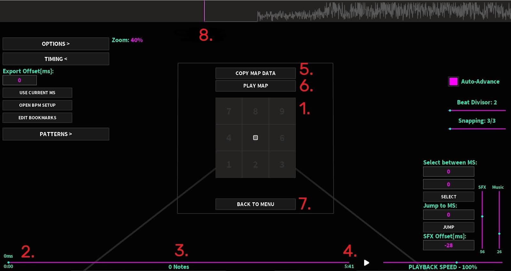
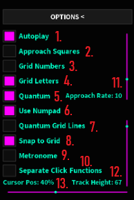
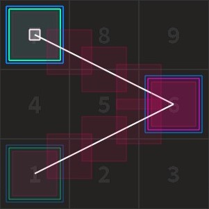

# Section I: Basic Editor usage
Learn how to map using the Sound Space Quantum Editor (SSQE, for short)

## 1: Installing the Editor

- Head over to the [releases page](https://github.com/David20122/SSQEUpdater/releases/latest) and click on the __.zip__ file.

- Once you have downloaded the .zip file, extract it.

- Once the zip file is extracted, run <u>SSQEUpdater.exe</u>. The Editor will be automatically set up and will also run afterwards.

## 2: Creating a map
On the menu that has popped up, you will see the following options:

- __Create New Map__: used to create a new empty map as well as its asset file.
- __Load Map__: used for loading saved maps.
- __Import Map__: used to import map data (raw data / GitHub links).
- __Settings__: mostly used for customizing.
- __Autosaved Map__: used to load an autosaved map, if one exists.
- __Edit Last Map__: used to load the last manually saved map.

Head over to _Create New Map_ to create a new map, then get an audio file of the song you want to map, either in __mp3__ or __ogg__ audio format.
If done correctly, the Editor layout should pop up (first image on the next section).

:::details
You'd normally need an audio ID from the Roblox Audio Library to map. However, this method is hardly viable since there are various restrictions over public audios (since March 2022).
Therefore, importing audios directly is the best way around.
:::

From here on, you can start placing down notes on the grid.

## 2.1: Editor assets
There are many assets in the Editor that may be helpful while mapping. Let's take a look at some of them:

:::info
This part of the tutorial is 100% accurate for SSQE v1.8.5.5 only. Versions before and after that may vary a bit.
:::

### Key Assets

These assets cannot be tampered with in any way and are mandatory to map:
1. __Grid__: Where the maps are built on. It is a 3x3 grid, meaning it has 3 blocks height and 3 blocks width. This can be further amplified using _Quantum_ (explained later):
2. __Progress Bar__: The bar represents the length of the song, while the dot over it represents the current timestamp, with a string above indicating it in milliseconds (ms) and another below in mm:ss format.
3. __Note Counter__: It shows the total number of notes in the map.
4. __Song Duration__: Shows how long the song lasts for.
5. __Copy Map Data__: Copies the data from the map’s file.
6. __Play Map__: Used to playtest your map in Rhythia. _You need to enable “Use SS+ for Playtesting” in “Settings” to use this_.
7. __Back To Menu__: Used to return to the Editor’s Menu. _Don’t forget to save your progress!_
8. __Track__: Here is where the placed notes are displayed. The pink bar on it shows the timestamp where the notes will be placed, while two red bars act as timestamp bounds for the song.

### Regular Assets
You might need to edit these assets while mapping:
1. **Zoom**: Zooms the track in or out. It can be triggered when scrolling while holding the “Ctrl” key down.
2. **Auto-Advance**: When activated, after placing a note, the track will automatically advance to the next divisor line.
3. **Beat Divisor**: Helps you divide a beat in several parts (subdivide), in order to map a section more accurately. Hold down the “Shift” key while scrolling to easily change it.
4. **Snapping**: While “Quantum” is triggered, it allows you to snap the notes to a subgrid of __3/x__ blocks spacing, where x is your input on the bar.
:::tip
If the main grid is x = 3; 3/3 = 1 block spacing, a subgrid could be x = 12; 3/12 = 0.25 blocks spacing.
:::
5. **Select between ms**: Selects every note from the first timestamp (upper keypad) to the second one (lower keypad).
6. **Jump to MS**: Moves the pink bar to a determined position on the map in milliseconds.
7. **SFX Offset**: Delays the hitsound by a certain offset.
8. **SFX**: Determines the SFX’s (sound effects’) volume.
9. **Music**: Determines the song’s volume.
10. **Playback Speed**: Speeds the song by a certain amount, down to 20% and up to 200%.

### Options, Timing and Patterns
They're located near the top left corner of the mapping menu.
### 1. Options

1. **Autoplay**: Triggers a cursor which will automatically play the map for you.
2. **Approach Squares**: Allows you to see the notes as they approach the grid.
3. **Grid Numbers**: Alows you to see the order of the notes you placed.
4. **Grid Letters**: Allows you to see the keyboard letter associated with each grid position.
5. **Quantum**: Enables you to push the limits of the 3x3 grid up to +0.875/-0.875, and inside the grid in intervals smaller than 1. Quantum notes aren't limited to certain positions on the grid, as seen later on.
6. **Use Numpad**: Enables the number pad on your keyboard for mapping. 1 becomes Z, 2 will be X and so on. 0 remains unused.
7. **Quantum Grid Lines**: Makes the grid lines readjust to the quantum divisor used in _Snapping_.
8. **Snap to Grid**: If enabled, it allows the notes to be snapped to the grid lines. Useful for quantum mapping.
9. **Metronome**: if enabled, emits a tick sound every beat. Can be adjusted using the beat divisor.
10. **Separate Click Flunctions**: Enables the player to see what clicking on the grid does
(by default, “Place”). For Quantum mapping, it is advisable to change it to “Select”.
11. **Approach Rate**: The notes will approach faster or slower depending on the slider’s position.
12. **Track Height**: Adjusts the height of the track.
13. **Cursor Pos**: Adjusts where the note will be placed, relative to the track. 0% will be topmost left and vice versa.

### 2. Timing

1. **Export Offset\[ms]**: The Offset that the map will have when exported, in milliseconds.
2. **Use Current ms**: Sets the Export Offset to the current timestamp.
3. **Open BPM Setup**: Allows to set up Timing Points (introduced later on).
4. **Edit Bookmarks**: Shows the current list of bookmarks for the map. These indicate the start/end of a part of the map. For example, they can be used to separate map sections. You only need to input a name and a timestamp for each of them.

### 3. Patterns

1. **Flips**: Selected notes will be flipped horizontally (_Shift+H_) or vertically (_Shift+V_) if these settings are triggered, respectively.
2. **Nodes**: The base for Quantum curves and slides. Clicking _Store Nodes_ while selecting notes will turn them into nodes, which will trace a Quantum pattern using red "pseudo-notes", as seen below:
  
You may unselect the nodes at any time by clicking _Clear Nodes_.
3. **Bézier Curves**: This function creates a curve via node-to-node iterations ([Bézier curve](https://en.wikipedia.org/wiki/Bézier_curve)) with the stored nodes. The red notes will be the curve output of the following nodes:
   

4. **Draw Bézier With Divisor**: Adjusts the note density of the curve. Clicking _Draw_ triggers the curve function.
5. **Rotate by Degrees**: Rotates _clockwise_ the selected notes by a certain amount in degrees, which can also be negative.
6. **Scale by Percent**: Scales the selected notes by a percent.

With that set, you’re done with the general usage explanation. You may check and edit the Editor’s keybinds in “Settings” >> “Change Keybinds” on the Editor’s main menu later on.

