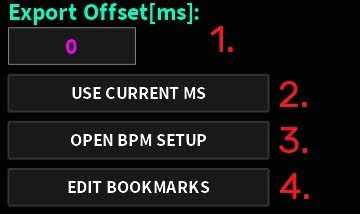
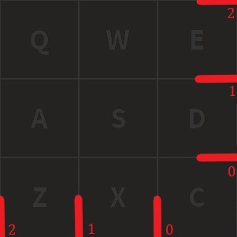

# Map creation
Learn how to make your very own maps using the Sound Space Quantum Editor (SSQE)

## Creating a map
On the menu that has popped up, you will see the following options:

- __Create New Map__: used to create a new empty map as well as its asset file.
- __Load Map__: used for loading saved maps.
- __Import Map__: used to import map data (raw data / GitHub links).
- __Settings__: mostly used for customizing.
- __Autosaved Map__: used to load an autosaved map, if one exists.
- __Edit Last Map__: used to load the last manually saved map.

Head over to _Create New Map_ to create a new map, then get an audio file of the song you want to map, either in __mp3__ or __ogg__ audio format.
If done correctly, the Editor layout should pop up (first image on the next section).

:::details
You'd normally need an audio ID from the Roblox Audio Library to map. However, this method is hardly viable since there are various restrictions over public audios (since March 2022).
Therefore, importing audios directly is the best way around.
:::

## Timing
Before starting to place notes, it's important to time the map properly using **timing points**.  
A timing point is such

You can set them up via: _Timing_ > _Open Timing Setup_:  

Inside this menu, we have a few more assets that have to do with timing points:
- **Add Point**: Adds a new Timing Point with said BPM and Offset to the list above. Said list can have as many timing points as needed, but cannot have repeated values.
- **Delete Point**: Deletes the selected Timing Point(s).
- **Update Point**: Updates the selected Timing Point(s) with the input BPM/Offset.
- **Current Pos**: Updates the input Offset to the current position on the track.
- **Move Selected Points (ms)**: Moves the selected Timing Point(s) according to the Offset.
- **Importing Timing Points**: Using _Paste Timings_ or _Open Beatmap Timings_, you may be able to import the timing points from another rhythm game's map. The latter supports:
  - osu! (any gamemode)
  - A Dance Of Fire And Ice (ADOFAI)
  - Clone Hero (CH)
- **Open BPM Tapper**: Allows you to approximate the song’s BPM by tapping a button to the beat.

:::tip
If the song you're mapping is popular enough to have a chart in another game, it's better to get the timings from it.  
This is also recommended in case you're not familiar with timing songs.
In case you want to learn how to, check out [this article](/mapping/extra/manual-bpm-timing).
:::

## Note placing
Now that you have everything set up, you can start placing down notes. The **keybinds** are as follows:
- **Q** or **7** for top left corner (2|2)
- **W** or **8** for top mid (1|2)                         
- **E** or **9** for top right corner (0|2)
- **A** or **4** for middle left (2|1)
- **S** or **5** for middle (1|1)
- **D** or **6** for middle right (0|1)
- **Z** or **1** for bottom left corner (2|0)
- **X** or **2** for bottom mid (1|0)
- **C** or **3** for bottom right corner (0|0)

:::info
If you have an older version of the Editor, you might also be able to use the Y key as bottom left corner.
:::  
:::details
The numbers represent the (-X|Y) coordinates of the note:  
  
As you can see, the X axis is inverted.
:::

## Mapping tips
A few tips in case you've never mapped any song before:
- **Play a lot of different maps before mapping** to get a feel of which patterns you like and which ones you don't.
- **Make sure you can beat your own maps**, playtesting is key to produce good maps.
- **Use BPM and Offset properly**. This does make a BIG difference once you get the hang of it.
- **All placed notes should be _snapped_**; that is, on a BPM line (any divisor).
- **It's more important to produce fun maps than hard maps.**
- **Do not rush, especially when you’re new to mapping**. 
And most importantly, **follow the community guidelines and have fun mapping!**

## Saving
Lastly, once you have finished mapping, you can save the map in three different ways:
- **Clicking _Ctrl_ + S**: Triggers a data overwrite, meaning your older save will be replaced.
- **Automatically**: Automatically overwrites the map’s data with a certain frequency (changed via _Settings_)
- **Clicking _Back to Menu_**: Triggers a popup which will ask the user to save before closing the map.  

:::tip
It is recommended that every map you make is stored in the Editor’s folder, so you won’t lose any.  
You may even have map folders inside of it!
:::

:::warning
You might notice that a .ini file has saved along with your map.  
This file includes the map's timing assets, so make sure you don't delete it.
:::

If everything went fine until now, you should have created your first map! Congratulations!
