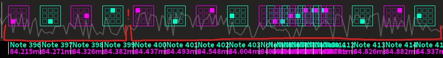

# Song Representation
Learn how to improve your beatmap representation

## Common terms
-**Build-up**: A song section that _builds up_ intensity, normally before a climax or drop.

## Structure

### Rhythmic layering
You might have noticed how songs usually have more than instruments playing at once, 
but only one instrument stands out, which corresponds to the song's **main melody**.  
In case of doubt, it should be the most _dynamic_ and _prominent_ instrument, 
and perhaps the most _recognizable_ one as well, meaning the song can be recognized by it.

The interaction between this instrument and the other, 
less important ones constitutes the **rhythm layering** of the map, where each _layer_ is represented by an _instrument_.
You can also think of it as a canvas with paint layers on it, 
where the combination of every one of them gives you the finished picture.

#### How to layer sounds properly
With only one melody (and one layer), there's no problem; however, 
things can get pretty complicated the moment the song starts throwing simultaneous melodies in.

1. Firstly, lay out the main melody; if you need to map the whole section for it, 
you may use a _straight_ to do so.

[leave gaps to add stuff tip here]

#### Conclusion
To improve your rhythmic layering, you may:
    - Selecting a **main melody** to follow (it should stand out the most).
    - Incorporating other rhythms in the song onto it (if needed)
      while giving each one the right amount of **emphasis** (see below).  
      _Remember that the main melody can be overridden at any given point!_

## Emphasis

### Spacing emphasis
:::tip  
For an introduction on **spacing**, check out [this document](basic_spacing).
:::

We already talked about how spacing can be used to enhance a map's playability. 
However, it can also be used to convey **expression**; for example, to represent an instrument 
that stands out from the others.  

Looking at this image, you'll notice that a **jump** (indicated in red) is used to cut short the pattern,
which announces a **sudden emphasis change**:  
  

Most notes in this example are _equally_ spaced since they have the same relevance in the song.
That means the note that forces the player's reaction (the jump's destination) is more important than the others.
_The spacing difference represents the intensity of the note being jumped to._

This manipulation is called **spacing emphasis** and most maps use it nowadays.    

#### Contrast
Spacing emphasis can be used to express **contrast** between 2 sections.
Take a look at this example:  
  

The intensity of the map changes on the 2nd measure, as the spacing is drastically different from before.
This is a case of _exponential contrast_.

Spacing changes don't always have to be that sudden; most maps' build-ups use _linear contrast_.
These sections _progressively_ increase spacing until the intensity matches that of the section after it.

#### Conclusion
Generally speaking, _spacing emphasis depends on the combination of the intensity of the map section/song, 
and the intensity of each individual instrument_. 
The latter should also represent _contrast_ between several melodies, which help distinguish the song's different sections.   

_However_, the map should remain intuitively readable
while each pattern should clearly represent something in the song.  

