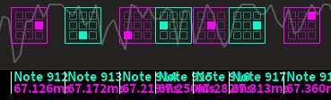
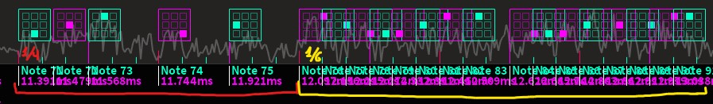
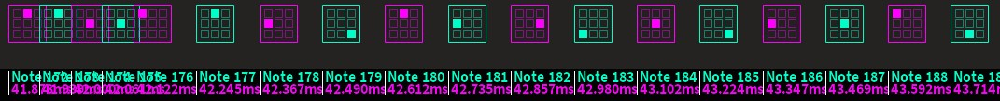
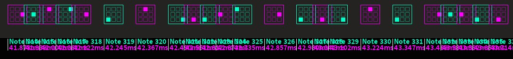

# Song Representation
Learn how to improve your song representation

## Common terms
-**Build-up**: A song section that _builds up_ intensity, normally before a climax or drop.

## Introduction
As you may already know, song representation consists in transforming a song into patterns
which can later on be played. It requires a good usage of the editor more than actual gaming skills.

So, without further ado, here are some handful techniques you may use to improve your map-making skills!
Most of them can be guessed by looking at good, popular maps over time
or just by mapping a lot.

## Some general guidelines
- _Every note in the map needs to be mapped to a sound in the song, but not the other way around._   
You may intentionally leave sounds/melodies out, as we'll see later.
- _It should be clear at all times what the main melody is._   
The main melody should be the most catchy and/or engaging instrument of the song. 
It doesn't have to be _exclusive_ (only 1 at a time) nor _unique_ (only 1 in the song).
- _The way a song is represented shouldn't negatively affect how a map is played._
This happens mostly when no playtesting is done; remember that **Execution > Representation**.

## Sync

### Complex rhythms
Most players are used to playing and most importantly, noticing 1/1, 1/2 and 1/4 beats. 
However, other time measures (such as 3/4) are often harder to read if the player doesn't expect them.
Let's take a look at some examples and how to handle them.

#### Binary rhythms and subdivision
If the rhythm can be subdivided into any other basic patterns, it's better to do so to lay out patterns as intuitively
as possible, using 1/2 and 1/4 gaps that players are more used to playing.
For example:
[WIP]

#### Other rhythms
If the rhythm doesn't fall into the case above, then it's likely that you've stumbled upon a **ternary** time measure.
Unlike _binary/quaternary_ time measures, _ternary_ ones are **3** beats long, 
so keeping the patterning consistent won't work.
Instead, it's better to add notes to the pattern in a way that difficulty is minimally increased.  

These notes are referred to as **passive** as they don't imply any speed change.
As an example, a 1/6 slide in the middle of a 1/4 section:  

As you can see here, the slide has been balanced out as it's simpler and less spaced than the previous pattern. 
Thus, _the difference between divisors should be reduced by making the faster patterns more approachable_.

### No-divisor syncing
Sometimes, there are sound effects that are either too distorted or imprecise that it's impossible to map them
fully accurately. This happens in vocal songs with held notes, for example.
In these cases, it's best to attempt to match the sound's density without making it overkill.
There are a few ways to accomplish this:

#### Raising the beat divisor
**Raising the beat divisor**, normally by 1.5/2 times the current one, is one way of syncing imprecise sounds.
This also helps to distinguish them from other rhythmic patterns and is also used to add **emphasis** (see below).  

For example, 1/6 is being used here instead of 1/4:    
  

_Although it might seem like it's breaking the current rhythm, certain beats still match_; 
use this information to your advantage.

#### Density inflation
Another possibility is to **inflate the map's density** without affecting the difficulty.   
Although there is no forced patterning, mappers normally use:
- **Meganotes** for short or heavy sounds
- **Slides** for prolonged or held sounds

For example, [this map](https://youtu.be/ru2HSc3-tu8)[1] emphasizes the difference between shorter and longer sounds.

#### Stacks
Lastly, a more 'classic' approach would be to just add **stacks** to every note for the duration of the sound.
_This solution has minimal impact on difficulty and can be used with the first solution simultaneously._

_A general rule for stacking is to use multiples or powers of the divisor you're mostly using._   
For example, 2-4-8-16-32 (**2^x**) or 3-6-12 (**multiples of 3**).  

If it's only for short stacks (1-3 notes) then you can use whatever divisor sounds most accurate.

## Structure

### Rhythmic layering
You might have noticed how songs usually have more than instruments playing at once, 
but only one instrument stands out, which corresponds to the song's **main melody**.

The interaction between this instrument and the other, 
less important ones constitutes the **rhythm layering** of the map, where each _layer_ is represented by an _instrument_.
You can also think of it as a canvas with paint layers on it, 
where the combination of every one of them gives you the finished picture.

#### How to layer sounds properly
With only one melody (and one layer), there's no problem; however, 
things can get pretty complicated the moment the song starts throwing simultaneous melodies in.
Let's tackle this issue step by step:

1. Firstly, **lay out the main melody**; even if it's just the rhythm.
2. Then, you may **fill in the remaining gaps with other instruments** you find interesting or noticeable.
_Make sure that all melodies can coexist rhythmically, that is, without overlapping with each other!_
3. Lastly, **check that the final result doesn't feel jarring to play**; 
stick to rhythms as basic as possible.
You may adapt this layout as many times as you wish during mapping.

_The higher the difficulty of the map, the more relevance the second step will have._ Check out these 2 map sections:

While the first section only uses 1/2 jumps, the second one incorporates other rhythms including 1/4 slides.
_Both ways of mapping this section are correct as the main melody stands out and the rhythmic structure makes sense._

#### Prioritizing
When the main melody fades out or completely stops, or a background melody becomes relevant even if for a little while, 
it's better to acknowledge what's going on in the background and create a rhythm
_exclusively_ made with background instruments. This is known as a **filler rhythm**.

Adding a filler rhythm provides some **benefits** such as:
- Keeping the intensity of the map more or less consistent.
- Keeping the player busy until the melody takes over again.
- Making a map section more engaging to play than if it were empty.

#### Conclusion
To sum everything up, in order to make a proper rhythmic structure for your map:
- **Be clear about your melodic choices**; make that each rhythm is given its due relevance in the map
- **Avoid jarring rhythms**; not every instrument/sound in the song needs to be mapped at all times

_This resource has a deep impact on note density, and should be congruent with the map's difficulty and intensity
at all times._ In other words, the rhythmic structure should get more complex on more intense sections,
and vice versa, regardless of the map's difficulty.

## Emphasis

### Spacing emphasis
:::tip  
For an introduction on **spacing**, check out [this document](basic_spacing).
:::

We already talked about how spacing can be used to enhance a map's playability. 
However, it can also be used to convey **expression**; for example, to represent an instrument 
that stands out from the others.  

Looking at this image, you'll notice that a **jump** (indicated in red) is used to cut short the pattern,
which announces a **sudden emphasis change**:  
  

Most notes in this example are _equally_ spaced since they have the same relevance in the song.
That means the note that forces the player's reaction (the jump's destination) is more important than the others.
_The spacing difference represents the intensity of the note being jumped to._

This manipulation is called **spacing emphasis** and most maps use it nowadays.    

#### Contrast
Spacing emphasis can be used to express **contrast** between 2 sections.
Take a look at this example:  
  

The intensity of the map changes on the 2nd measure, as the spacing is drastically different from before.
This is a case of _exponential contrast_.

Spacing changes don't always have to be that sudden; most maps' build-ups use _linear contrast_.
These sections _progressively_ increase spacing until the intensity matches that of the section after it.

#### Conclusion
Generally speaking, _spacing emphasis depends on the combination of the intensity of the map section/song, 
and the intensity of each individual instrument_. 
The latter should also represent _contrast_ between several melodies, which help distinguish the song's different sections.   

_However, the map should remain intuitively readable while each pattern should clearly represent something in the song._  

## Sources
[1] [Kobaryo - Sparkling Software v2.0](https://discord.com/channels/1064060807320702996/1260851465409396756)