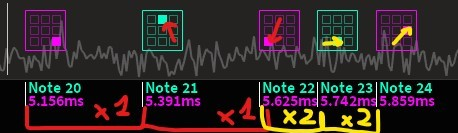
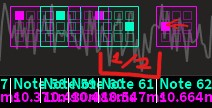
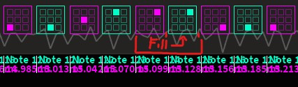

# Basic Spacing
Learn how spacing can be used to enhance a beatmap

## Introduction
The **spacing** between notes constitutes a medium of expression throughout any map.
A proper spacing usage can help with **pattern recognition** which allows players to intuitively tell how to hit patterns.

## Spacing concepts
The main concept for spacing usage in this game is **time-distance equality**, meaning the spacing between the notes
on the grid should be more or less equal to the spacing between those same notes on the track.  
An example could be:  

This is especially present in difficulties under LOGIC?, so that beginners may tell the difference between certain patterns.
The most common spacing examples on the track are **1/2** and **1/4** spacings for **jumps** and **slides/spirals** respectively.

But on harder maps, this is usually paired with **visual consistency** between rhythms, in order to express the song's mood better.

You may think that the rule above is flawed, but the exact spacing between the notes doesn't matter as long as the player can guess
how fast they should move at any given point, and that is achieved with **consistent spacing**;
_similar rhythmic patterns should have similar spacings on the grid._

## What about other, less common gaps?
In these cases, one needs to be careful so that the pattern won't be misleading
(_adding sudden speed changes to patterns can severely affect gameplay!_).   
For example, when adding a **1/1** gap in between **1/2** spacings, one can do the following:
- Make the spacing on the grid larger (following time-distance equality), which can potentially lead to a pattern change.
- Make it a stack, to prevent the player from moving at all.

This trick also works the other way around.

### Some edge cases
- Gaps longer than 1/1 usually cause no problems as the previous note
  will have likely been hit as you prepare for the next one.
- Gaps using other time measures (like 1/3) or syncopated gaps (like 3/4) are usually handled by **intuition**,
  so the pattern matters more than the spacing between notes.

## Slide/Spiral ends and spacing
When dealing with the end of a **shortly-spaced note sequence** (like a slide or a spiral),
it's almost mandatory to leave an additional gap since the player will need to most likely jump to the next note.  
An example could be:  

The spacing in this case matches that of a jump, but it doesn't always need to be like that.
_Tighter time spacings make the movement more strict, and vice versa._
This can also be used along with to reflect the mood of the song.

:::tip  
If it feels like the pattern misses any sound during said time gap, it can be _filled_ with notes on a lower divisor.
For example, the gap here is filled with stacks:

:::

## Distinguish sections based on spacing
Spacing doesn't need to be consistent throughout the map, but only throughout a section.
It's logical to think that break sections should be less intense than drop sections,
and this can be achieved via **spacing regulation**.

In most cases, drops halve the spacings used, so **1/1** jumps become **1/2**, **1/2** slides/spirals become **1/4**,
and so on.

